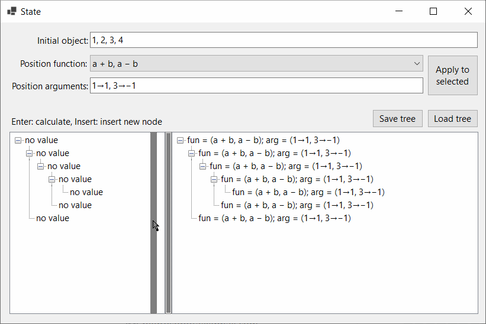

Compose2 aims to describe abstractly differences in any type objects and implement basic algorithms for difference creation, validation, and to apply, manipulate, persist, etc. changes to objects. Two applications to illustrate the change engine are:

1. A musical structure representation language
2. A file and directory versioning program/version control system.

The project aims to define a small language to describe change functions. As such a parser, etc. is implemented. The parser is also implemented in JavaScript.

A GUI is also present to explain and facilitate performing the various manipulations with changes visually.

